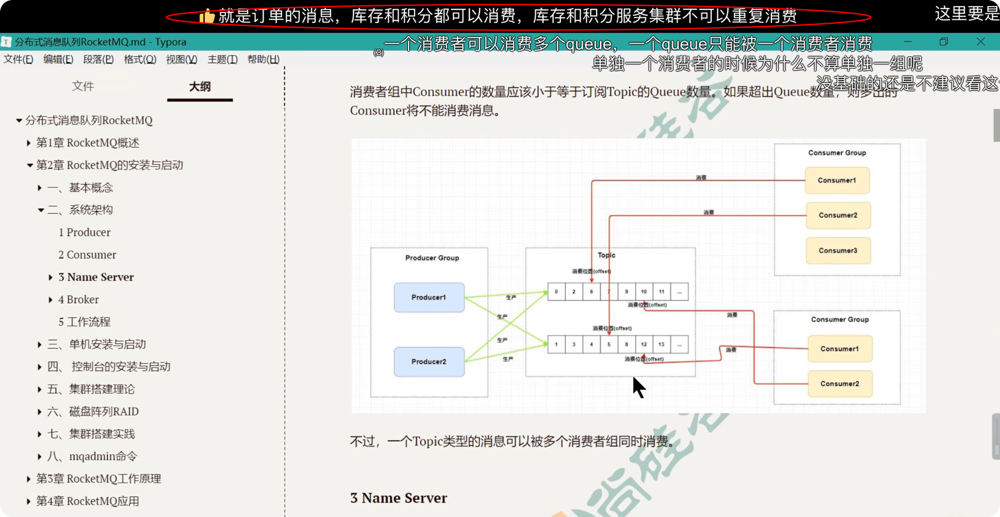

在接触RocketMQ这些奇奇怪怪的能与不能的规则之前，先将各种名词映射到一个具体业务上，各种规则就变得理所当然了

1.生产者可以看做是一个服务，生产者组就是订单服务集群。
  1.1. 比如 Producer_group_1 可以看成是 订单服务；
    1.2. 另外  Producer_group_2 可以看成是 登录服务。

2.消费者可以看成是另一个服务，消费者组就是库存服务集群。
  2.1.比如 Consumer_group_1 可以看成是 库存服务；
    2.2. 比如 Consumer_group_2 可以看成是 积分服务。
      2.2. 比如 Consumer_group_3 可以看成是 收集日志的服务。

3.一个 Brocker 是存储消息的物理实体，可以看做是一台电脑，通常Brocker 也是以集群形式向外提供工作。
【为了简单起见，我们假设Brocker_2 已经断网了(图中灰色部分)】
  3.1.一个 Brocker 中可以放很多 Topic， 一个 Topic 就是指一类 Message。
    3.1.1.比如 Topic_1 可以看成是商品订单信息
      3.1.1.1.Topic中的Queue 都是一样的数据结构，一个Queue 中可以在内存中暂存多条 Message
        3.1.1.1.1. 一条Message 包含
          a.MessageId
          b.OffsetId
          c.Tag
          d. 比如订单信息(订单id，订单商品，商品数量，订单金额)
    3.1.2.比如 Topic_2 可以看成是 用户登录信息
      3.1.2.1.同上
        3.1.2.1.1. 一条Message 包含
          a.MessageId
          b.OffsetId
          c.Tag
          d. 比如订单信息(用户id，密码)
3.2. 另一个 Brocker, 【需要注意的是，一个 Topic 可以分散到多个 Brocker 机器上(这也成为分片，分片并不是RockerMQ 官方的概念)】

4.NameServer 就是注册中心，相当于一个电话本，该电话本会被各注册到该注册中心的服务个字复制一份，并定时同步。
  4.1.在初代的 RockerMQ 中，曾经用过ZooKeeper 做注册中心。

---
接下来是那些能与不能的规定:
1. 一个 Producer 可以向多个 Topic 发送 Message
   https://rocketmq.apache.org/zh/docs/domainModel/04producer/
   如订单服务 既可以向 订单Topic 发送消息, 又可以向日志 topic 发送消息
2. 一个 Brocker 中可以放很多 Topic， 一个 Topic 就只能存放一类 Message。
    如订单 Topic 只能存放 订单 Message, 不能存放 用户行为日志 Message
    2.1 一个 Queue 只能被一个 Consumer_Group 中的一个 Consumer 消费; 一个Queue 不能被处于同一个 Consumer_Group 中 2 个Consumer 消费, 
        但是多个 Consumer_Group 可以同时消费同一个 Topic 的消息.
        [这个规则虽然拗口,但是映射到实际业务就会很利索当然:
            就是订单Tipic 中的一个 Queue，库存Cunsumer_Group 和 积分 Consumer_Group 都可以消费，
            但是库存 Cunsumer_Group 之内的 两个 Consumer 不能从 同一个 Queue 中消费,。
        ]
        
        当然当某个 Consumer 挂了, 则该 Consumer 的 Consumer_Group 中的其他 Consumer 可以继续消费该 Topic 的消息
3. Consumer
3.1. 一个 Consumer_Group 只能消费一个 Topic 的消息, 不能同时消费多个 Topic 的消息
3.2. 一个 Consumer_Group 内的所有 Consumers, 必须订阅 "完全相同" 的一个 topic (涉及订阅关系的一致性)

---

RocketMQ 集群搭建最佳实践
一个Master Broker 使用 RAID10 磁盘阵列, 再为其配置一个 Slave Broker.

集群搭建  实践

---
基本的单节点部署QuickStart官方文档:https://rocketmq.apache.org/zh/docs/4.x/introduction/02quickstart
详细集群搭建的过程官方文档:
https://rocketmq.apache.org/zh/docs/4.x/deployment/01deploy