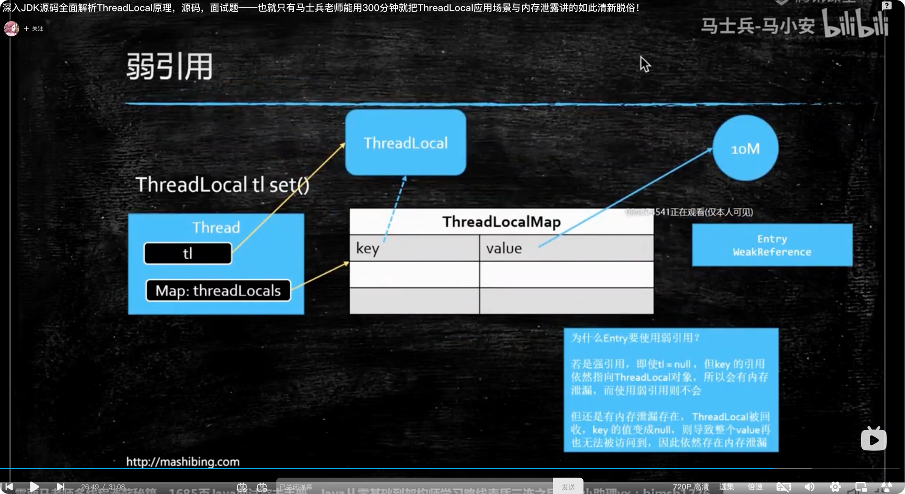

# ThreadLocal 使用不当会导致内存泄漏的原因
https://www.bilibili.com/video/BV1ZY4y1P799?p=4

1. 这里面涉及 4 个类,
   1. Thread 类
   1. ThreadLocal 类
   1. ThreadLocalMap 类
   1. Entry 类 extends WeakReference<ThreadLocal<?>>
      1. 弱引用是指一个对象如果只被被弱引用指向,那一旦发生 GC 它就会被回收,前提是该对象只被弱引用指向,
      1. 假如还有一个强引用指向它,那它就不会被回收, Entry 的 key 恰好就是一强一弱 2 个对象指向它.
      1. 这里面有一很重要就是  Entry 继承自 WeakReference 类的意思是说 WeakReference的 Constructor 参数赋值给成员变量,该成员变量指向堆内对象是弱引用(jdk注释写的很清楚).
      1. 也就是说 new Entry 的时候, 构造器参数中的 key 指向 堆中 ThreadLocal 对象是一个弱引用, 刚刚说了有一强一弱 2 个引用指向 threadLocal 对象,那那个强引用是谁呢?
      1. 就是我们的业务代码中 ThreadLocal tl = new ThreadLocal(); 这就是那个强引用.
      1. 在使用线程池的场景中,就有可能发生 tl 强引已经不引用了, 而线thread 对象一直存在,进而其包含的 ThreadLocalMap 一直在,此时 key 弱引用指向 tl 所指向的 那个 ThreadLocal 对象,key会被 GC 直接回收 key=null 了,WeakReference 的作用正是为了方便回收 key.
      1. 此时 Entry 中的key 为 null 即业务代码再也不需要 value 了,然而 thread 对象还在,threadLocalMap 中的 value 就不会被回收, 就出现**业务上没有用处的对象一直在内存在无法回收**, 即内存泄漏.
      1. 随着 thread 对象在线程池中被反复使用, 这种泄漏可能会越积越多,造成 OOM.
1. 解决方式就是不需要 ThreadLocal 中的变量了,要执行一下 remove 方法,其实现中有一句就是,让 value= null; 这样 value 就会被回收.
1. 另外,刚才说的这个 Entry 数组实现的 hashMap 其解决 Hash 冲突的方式线性探测法, 之所以采用这种方式是,它比较适合小数据量的 hashMap

1. ThreadLocal 的应用场景是
   1. 实现每个线程中有一个变量副本,达到线程隔离的目的, 像链路追踪的场景, 每个线程中有一个链路追踪的上下文, 通过 ThreadLocal 来实现, 这样每个线程中都有一个链路追踪的上下文, 不用担心线程安全问题.
   1. 还有一个场景就是 将一个对象绑定在线程上, 达到无论方法调用栈怎样被弹出,这个对象依然随着当前线程一直存在, MyBatis 中就是通过 ThreadLocal, 将 首次从 连接池中取到的 connection 对象绑定在 线程上 来实现基于 connection 的事务.

