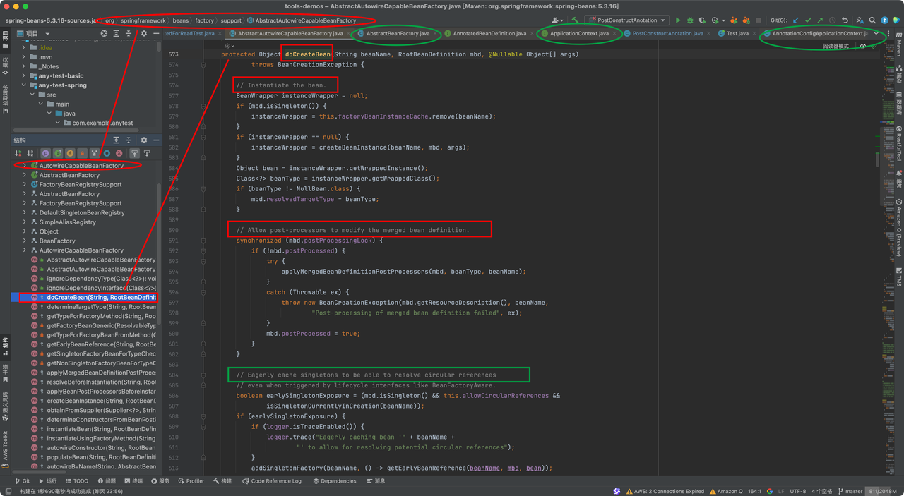
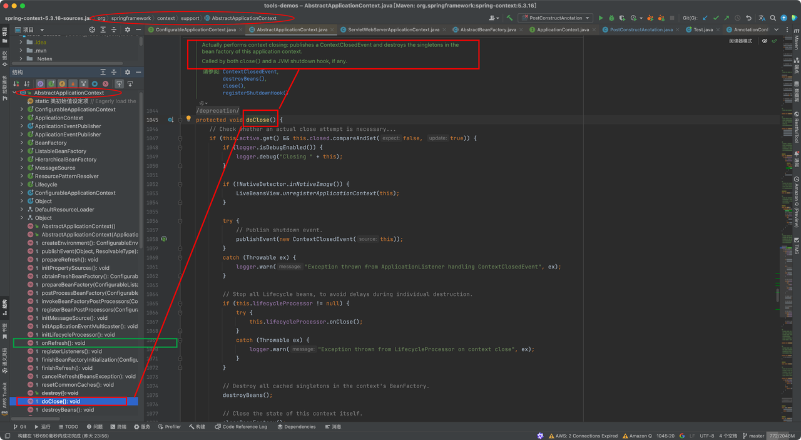

Spring中bean的生命周期详解（面试说辞）
https://blog.csdn.net/knknknkn8023/article/details/107130806/
https://www.cnblogs.com/xushuanglong/p/14632982.html

分为4个阶段：
①实例化 Instantiation
②属性赋值 Populate
③初始化 Initialization
④销毁 Destruction
    其中实例化和属性赋值分别对应构造方法和setter方法的注入，
    初始化和销毁是用户能自定义扩展的两个阶段。

前①②③步都在：AbstractAutowireCapableBeanFactory 类的 doGetBean() 方法中  (类名中文意思：_具有 Autowire 功能的抽象 Bean 工厂_)

// 忽略了无关代码后
protected Object doCreateBean(final String beanName, final RootBeanDefinition mbd, final @Nullable Object[] args) {

     // Instantiate the bean.
     BeanWrapper instanceWrapper = null;
     if (instanceWrapper == null) {
         // ①实例化阶段！
        instanceWrapper = createBeanInstance(beanName, mbd, args);
     }

     // Initialize the bean instance.
     Object exposedObject = bean;
     try {
         // ②属性赋值阶段！
        populateBean(beanName, mbd, instanceWrapper);
         // ③初始化阶段！
        exposedObject = initializeBean(beanName, exposedObject, mbd);
     }
}

第4步销毁阶段是在容器关闭时调用的，在 AbstractApplicationContext 类的 doClose() 方法中

// 忽略了无关代码后
protected void doClose() {
    // Destroy all cached singletons in the context's BeanFactory.
    ④销毁 Destruction    
    destroyBeans();
}

常用的扩展点：
影响多个bean的接口
两个最重要的接口
1.InstantiationAwareBeanPostProcessor 接口作用类于实例化前后
#postProcessBeforeInstantiation(Class<?> beanClass, String beanName)
#postProcessBeforeInstantiation(Class<?> beanClass, String beanName)
     2.BeanPostProcessor 接口作用bean于初始化前后
      #postProcessBeforeInitialization(Object bean, String beanName)
      #postProcessAfterInitialization(Object bean, String beanName)
  /*
  四个主生命周期
           （1.1）实例化之前干预  InstantiationAwareBeanPostProcessor.
                                                     postProcessBeforeInstantiation(Class<?> beanClass, String beanName)
       1.实例化
            （1.2）实例化之后干预   InstantiationAwareBeanPostProcessor.
                                                       postProcessAfterInstantiation(Class<?> beanClass, String beanName)
       2.属性赋值

            （3.1）初始化之前干预  BeanPostProcessor.
                                                  postProcessBeforeInitialization(Object bean, String beanName)
       3.初始化化(比如准备资源文件)
              (3.2) 属性进行干预  ----修改属性或属性值
              (3.3）初始化之后干预  BeanPostProcessor.
                                                  postProcessAfterInitialization(Object bean, String beanName)
       4.销毁(释放资源---singleton对象从内存销毁)

   N个接口
       1、干预多次
           1)BeanPostProcessor
       2、干预一次
           1）Aware
   */